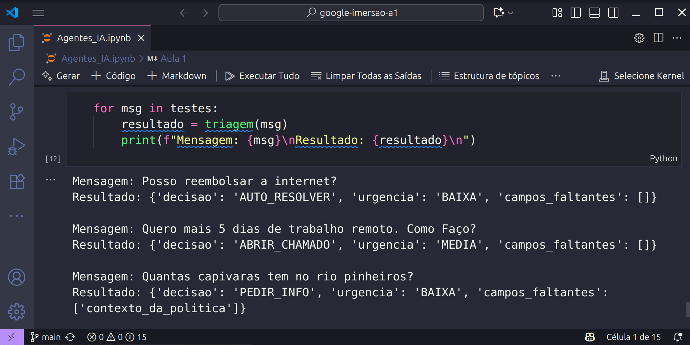
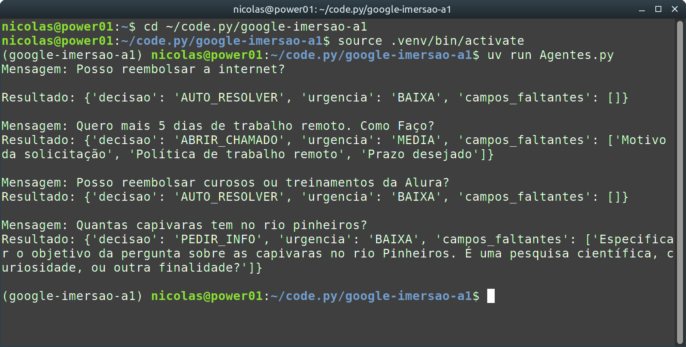

# Google e Alura imersão de Agentes de IA Aula 1

## O primeiro e feito com Notebook, Colab e Gemini

> Notebook_a1 [Notebook_a1](https://github.com/NicolasMCP/google-imersao-a1/blob/main/Agentes_IA.ipynb)

## O segundo é feito com vs.code e Gemma3 (SEM LIMITES)

> Agentes.py [Agentes.py](https://github.com/NicolasMCP/google-imersao-a1/blob/main/Agentes.py)

**Projetos de Nícolas Ramos**
 
&nbsp;&nbsp;&nbsp;&nbsp;&nbsp;&nbsp;&nbsp;&nbsp;&nbsp;[nicolas.mcp@gmail.com](mailto:nicolas.mcp@gmail.com)